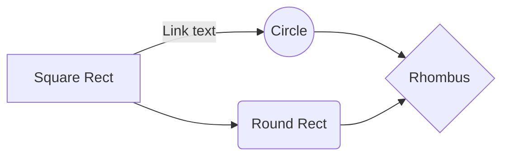
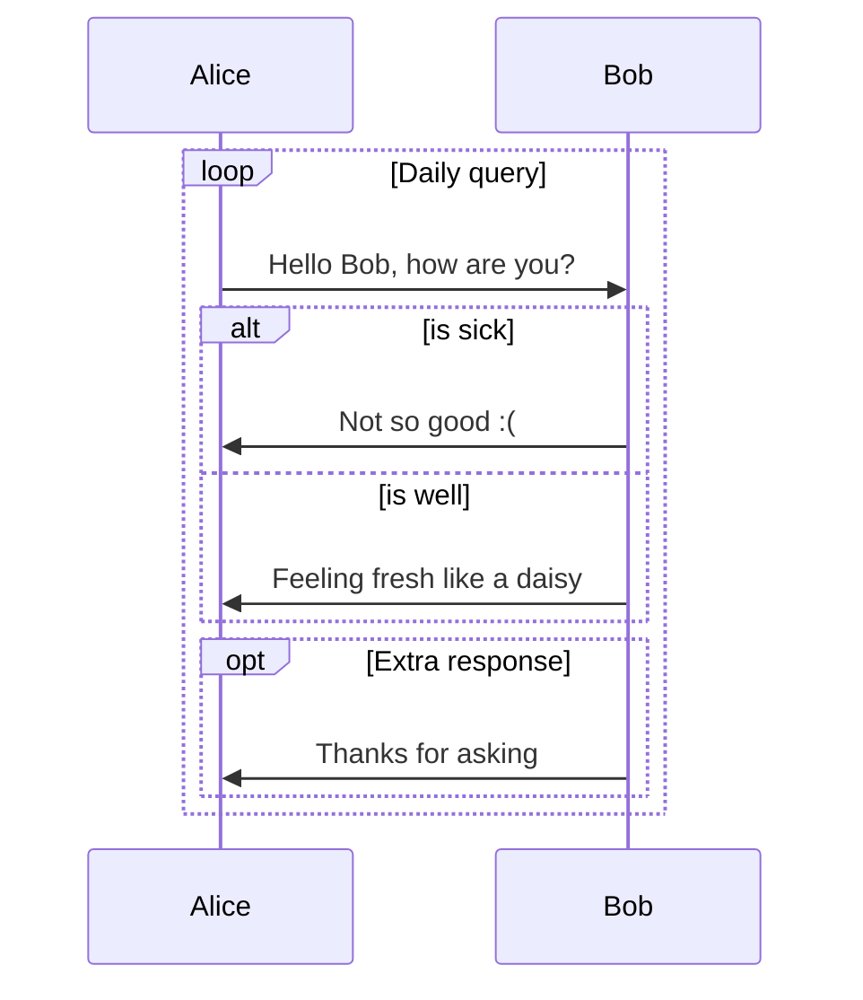

:::note info
跳票N久终于更新的简单的使用说明
- [hexo-theme-shoka](https://github.com/amehime/hexo-theme-shoka) ：本博客自用的主题
- [hexo-renderer-multi-markdown-it](https://github.com/amehime/hexo-renderer-multi-markdown-it)：配套的markdown渲染器

已经支持hexo 5。。。本文档不定期更新中
:::

# 设计缘由
前几年在Bear和Evernote上整理了大量笔记，非常喜欢Bear默认的markdown渲染样式。
后来因为换了安卓手机，用不了Bear，四处搜寻替代品，没有满意的。
然后阴差阳错知道了Hexo，又得知Github也可以免费建私有仓库了，故再次转移阵地到了自建博客，并部署在Github Pages。

因为这个博客是用来记笔记的，故起名`书架`。
对应的主题即`Theme.Shoka`，可以说是为了笔记阅读而生的主题。
样式严重参考Bear，部分代码严重参考[NexT](https://github.com/theme-next/)。

Hexo的默认及常用渲染器均使用`highlight.js`进行代码高亮，而我喜欢`Prism.js`，故重写了一个渲染器配合主题食用。
渲染器取名`multi`，因为集成了很多很多很多`markdown-it`插件，以及压缩静态文件的功能。
（最新版的默认渲染器也支持`Prism.js`了，可喜可贺，但不想用，哈哈哈哈哈哈哈

墙内Github Pages访问速度时而感人，所以用了[jsDelivr](http://www.jsdelivr.com/)加速，主要是因为它可以按需合并依赖文件。

# 安装依赖插件
Theme Shoka依赖以下Hexo插件

插件名称|npm地址|功能|依赖程度
--|--|--|--
hexo-renderer-multi-markdown-it|[链接](https://www.npmjs.com/package/hexo-renderer-multi-markdown-it)|md文件渲染器，压缩css/js/html | 必需
hexo-autoprefixer|[链接](https://www.npmjs.com/package/hexo-autoprefixer)|给生成的css文件们添加浏览器前缀 | 必需
hexo-algoliasearch|[链接](https://www.npmjs.com/package/hexo-algoliasearch)|站内搜索功能 | 搜索按钮失灵
hexo-symbols-count-time|[链接](https://www.npmjs.com/package/hexo-symbols-count-time)|文章或站点字数及阅读时间统计 | 左侧统计没有
hexo-feed|[链接](https://www.npmjs.com/package/hexo-feed)|生成Feed文件| 左侧文件没有

> 没有正确安装以上插件的话，本主题会报错or无法正确显示or部分功能失效。
> `hexo-renderer-multi-markdown-it`请注意升级到最新版

安装完以上插件后，修改站点`_config.yml`文件，加入相关配置。

## multi-markdown-it安装与配置

### 安装

1. 安装前，记得务必卸载掉默认的`hexo-renderer-marked`，以及别的markdown文件渲染器。
    ```bash
    npm un hexo-renderer-marked --save
    # 或者
    yarn remove hexo-renderer-marked
    ```

2. 安装
    ```bash
    npm i hexo-renderer-multi-markdown-it --save
    # 或者
    yarn add hexo-renderer-multi-markdown-it
    ```

3. 如果安装缓慢，或者失败
    如报错
    ```bash
    ERROR: Failed to download Chromium r515411! Set "PUPPETEER_SKIP_CHROMIUM_DOWNLOAD" env variable to skip download.
    ```
    因为有一步需要下载puppeteer里的Chromium内核，基于天朝内部网络现状，这一步能不能成功要靠科学和运气，所以为了避免安装失败，需要加上`--ignore-scripts`跳过Chromium内核的下载。
    ```bash
    npm i hexo-renderer-multi-markdown-it --save --ignore-scripts
    # 或者
    yarn add hexo-renderer-multi-markdown-it --ignore-scripts
    ```
    puppeteer主要是用来渲染mermaid流程图，只要文章中不使用mermaid就没有任何问题，如果要使用mermaid建议还是想办法完全安装。

### 配置

1. 加入`markdown`配置，用来渲染md文件
```yml
markdown:
  render: # 渲染器设置
    html: false # 排除html标签
    xhtmlOut: true
    breaks: true
    linkify: true
    typographer: 
    quotes: '“”‘’'
  plugins: # markdown-it插件设置
    - plugin:
        name: markdown-it-toc-and-anchor
        enable: true
        options: # 文章目录以及锚点应用的class名称，shoka主题必须设置成这样
          tocClassName: 'toc'
          anchorClassName: 'anchor'
    - plugin:
        name: markdown-it-multimd-table
        enable: true
        options:
          multiline: true
          rowspan: true
          headerless: true
    - plugin:
        name: ./markdown-it-furigana
        enable: true
        options:
          fallbackParens: "()"
    - plugin:
        name: ./markdown-it-spoiler
        enable: true
        options:
          title: "你知道得太多了"
```

2. 加入`minify`配置，压缩css/js/html
```yml
minify:
  html:
    enable: true
    exclude: # 排除hexo-feed用到的模板文件
      - '**/json.ejs'
      - '**/atom.ejs'
      - '**/rss.ejs'
  css:
    enable: true
    exclude:
      - '**/*.min.css'
  js:
    enable: true
    mangle:
      toplevel: true
    output:
    compress:
    exclude:
      - '**/*.min.js'
```

3. 停用默认代码高亮功能
```yml
highlight:
  enable: false

prismjs:
  enable: false
```

## autoprefixer配置建议

```yml
autoprefixer:
  exclude:
    - '*.min.css'
```

缺少这个插件，首页卡片翻转效果在部分浏览器中无法正确显示。

## algolia配置建议

```yml
algolia:
  appId: #Your appId
  apiKey: #Your apiKey
  adminApiKey: #Your adminApiKey
  chunkSize: 5000
  indexName: #"shoka"
  fields:
    - categories
    - content:strip:truncate,0,2000
    - gallery
    - path
    - photos
    - tags
    - title
```

## feed配置建议

```yml
keywords: #站点关键词，用“,”分隔

feed:
    limit: 20
    order_by: "-date"
    tag_dir: false
    category_dir: false
    rss:
        enable: true
        template: "themes/shoka/layout/_alternate/rss.ejs"
        output: "rss.xml"
    atom:
        enable: true
        template: "themes/shoka/layout/_alternate/atom.ejs"
        output: "atom.xml"
    jsonFeed:
        enable: true
        template: "themes/shoka/layout/_alternate/json.ejs"
        output: "feed.json"
```

# Theme Shoka 配置概要
## 配置文件
Hexo5可以在根目录新建一个yml文件，命名为`_config.shoka.yml`。
将自定义配置保存于此，方便后续主题升级。

## 站点别称
```yml
alternate: Yume Shoka
```
这里设置的名称代替Logo，显示在页面顶部，以及页尾:copyright:处

## 静态文件目录
```yml
statics: / #//cdn.jsdelivr.net/gh/amehime/shoka@latest/
```
默认值是`/`，指使用本地静态文件
可以修改成`//cdn.jsdelivr.net/gh/您的github用户名/您的项目名@latest/`这种形式，以使用jsDelivr进行加速。
PS：jsDelivr并不是实时更新，重新生成文件后需要耐心等待

```yml
assets: assets
css: css
js: js
images: images
```
静态文件所处目录的实际目录名，这些一般不改。

## 加载谷歌字体
```yml
font:
  enable: true
  # Font options:
  # `external: true` will load this font family from `host` above.
  # `family: Times New Roman`. Without any quotes.
  # `size: x.x`. Use `em` as unit. Default: 1 (16px)

  # Global font settings used for all elements inside <body>.
  global:
    external: true
    family: Mulish
    size:

  # Font settings for alternate title.
  logo:
    external: true
    family: Fredericka the Great
    size: 3.5

  # Font settings for site title.
  title:
    external: true
    family: Noto Serif JP
    size: 2.5

  # Font settings for headlines (<h1> to <h6>).
  headings:
    external: true
    family: Noto Serif SC
    size:

  # Font settings for posts.
  posts:
    external: true
    family:

  # Font settings for <code> and code blocks.
  codes:
    external: true
    family: Inconsolata
```
此功能基本参考NexT。
加粗标题的字体总是使用`Noto Serif`，为了正确友好的显示日文中的汉字，会先后加载`headings`和`title`的字体设置。

## 菜单与社交按钮icon
这里没有直接使用Font Awesome，是因为用不到那么多icon感觉非常浪费，因此在Iconfont上重新建立了一个项目。
`font-family`设为`ic`，所有字体样式前缀为`i-`，具体参见`themes/shoka/source/css/scaffolding/iconfont.styl`。

```yml
menu:
  home: / || home
  about: /about/ || user
  posts:
    default: / || feather
    archives: /archives/ || list-alt
    categories: /categories/ || th
    tags: /tags/ || tags
  # friends: /friends/ || heart
  # links: /links/ || magic

social:
  github: https://github.com/yourname || github || "#191717"
  #google: https://plus.google.com/yourname || google
  twitter: https://twitter.com/yourname || twitter || "#00aff0"
  zhihu: https://www.zhihu.com/people/yourname || zhihu || "#1e88e5"
  music: https://music.163.com/#/user/home?id=yourid || cloud-music || "#e60026"
  weibo: https://weibo.com/yourname || weibo || "#ea716e"
  about: https://about.me/yourname || address-card || "#3b5998"
  #email: mailto:yourname@mail.com || envelope || "#55acd5"
  #facebook: https://www.facebook.com/yourname || facebook
  #stackoverflow: https://stackoverflow.com/yourname || stack-overflow
  #youtube: https://youtube.com/yourname || youtube
  #instagram: https://instagram.com/yourname || instagram
  #skype: skype:yourname?call|chat || skype
```
如上，使用`||`作为分隔符，依次为 `链接 || 图标 || 颜色`。
注意，只需要写图标名称，如`github`，则会自动转换为`ic i-github`。
十六进制颜色码需要`""`包绕。

`menu` 支持一级子目录，子目录设置中的第一项必须为`default`，用来定义父级按钮的样式。
菜单显示文字在`<root>/themes/shoka/languages/`语言包中定义：

```yml
menu:
  home: 首页
  posts: 文章
  archives: 归档
  categories: 分类
  tags: 标签
  about: 关于
  search: 搜索
  friends: 友達
  links: 网址
  travellings: 开往
```

## 图片修改
位于`<root>/themes/shoka/source/images/`目录里的图片们都是可以修改的。

1. 修改头像 `avatar.jpg` 
  如果要设置不同的文件名，或者其他非本地图片，需要修改`<root>/themes/shoka/layout/_partials/sidebar/overview.njk`文件的第3行。

2. 修改打赏二维码文件，共三个

3. 修改 `favicon.ico`和`apple-touch-icon.png`

4. 修改随机图库
  图片列表位于`<root>/themes/shoka/_images.yml`中。
  使用了渣浪图库，使用一些上传工具，比如[这里](https://pic.gimhoy.com/)
  上传后图片的链接是`http://wx4.sinaimg.cn/large/6833939bly1gicmnywqgpj20zk0m8dwx.jpg`。
  只需要增加一行，写上`- 6833939bly1gicmnywqgpj20zk0m8dwx.jpg`。

## 背景音乐
在主题`_config.yml`文件中设置全局播放列表。
在文章的 Front Matter 中，设置文章专有播放列表，访问该文章页面时，将覆盖全局配置。

```yml
audio:
  - https://music.163.com/song?id=1387098940
  - https://music.163.com/#/playlist?id=2088001742
  - https://www.xiami.com/collect/250830668
  - https://y.qq.com/n/yqq/playsquare/3535982902.html
```
如上，可以直接使用网易云、虾米、QQ音乐的播放列表、单曲，可以同时填写多个。


## 文章字数及阅读时间统计

安装好hexo-symbols-count-time插件后，不需要修改站点配置文件，直接使用插件默认配置就行。

需要修改主题配置文件，找到两处`cout`，修改为`true`：

```yml
# 文章字数统计
post:
  count: true

# 页尾全站统计
footer:
  since: 2010
  count: true
```

## 文章评论
在主题`_config.yml`文件中设置好LeanCloud的appId和appKey，[如何获取戳此](https://valine.js.org/quickstart.html)。

```yml
valine:
  appId: #Your_appId
  appKey: #Your_appkey
  placeholder: ヽ(○´∀`)ﾉ♪ # Comment box placeholder
  avatar: mp # Gravatar style
  pageSize: 10 # Pagination size
  lang: zh-CN
  visitor: true # Article reading statistic
  recordIP: true # Whether to record the commenter IP
  serverURLs: # When the custom domain name is enabled, fill it in here (it will be detected automatically by default, no need to fill in)
  requiredFields:
    - nick
    - mail
  enableQQ: true
  masters: ['主人email的MD5值', '另一个email的MD5值']
  masterTag: 主人
  tips: "昵称框中填入QQ号，将自动获取QQ昵称&邮箱&头像；其他邮箱由Gavatar提供头像。"
```

## 加载第三方组件
```yml
vendors:
  css:
    katex: npm/katex@0/dist/katex.min.css
    comment: css/comment.css
  js:
    pace: npm/pace-js@1.0.2/pace.min.js
    pjax: npm/pjax@0.2.8/pjax.min.js
    fetch: npm/whatwg-fetch@3.4.0/dist/fetch.umd.min.js
    velocity: npm/velocity-animate@1.5.2/velocity.min.js
    velocity_ui: npm/velocity-animate@1.5.2/velocity.ui.min.js
    algolia: npm/algoliasearch@4/dist/algoliasearch-lite.umd.js
    instantsearch: npm/instantsearch.js@4/dist/instantsearch.production.min.js
    lazyload: npm/lozad@1/dist/lozad.min.js
    quicklink: npm/quicklink@2/dist/quicklink.umd.js
    mediumzoom: npm/medium-zoom@1.0.5/dist/medium-zoom.min.js
    valine: js/valine.js
    copy_tex: npm/katex@0/dist/contrib/copy-tex.min.js
    chart: npm/frappe-charts@1.5.0/dist/frappe-charts.min.iife.min.js
```
包括

--|--|--
`pace` | 加载进度条|全局
`pjax` | 页面无刷新加载|全局
`velocity` | js页面动画效果|全局
`algolia` `instantsearch`| 基于algolia的站内搜索|全局
`lazyload` | 图片懒加载|全局
`quicklink` | 链接资源预加载|全局
`fetch` | 获取播放列表|全局
`katex` `copy_tex`|数学公式显示及复制|按需
`mediumzoom` | 图片放大显示|按需
`valine` | 基于LeanCloud的评论系统及文章阅读次数统计|按需
`chart` | 图表显示|按需

以上文件加载全部基于jsDelivr，并对全局加载的组件进行了文件合并。
如果不明白啥意思，则不要轻易修改。

# 首页显示
## 文章图片
- 如果文章的Front Matter设置了`cover: image path`，则封面会显示这张图片。
```yml 举个栗子
title: Images
cover: assets/wallpaper-2572384.jpg
# 或者写成
cover: http://placehold.it/350x150.jpg
---
```
这里`cover`的值可以是位于`source`目录里的图片文件，此处是`<root>/source/assets/wallpaper-2572384.jpg`文件，也可以是一个某网址。

- 如果文章是一个`gallery post`，即Front Matter设置了`photos`，则会封面会显示设置的第一张图片。
```yml 举个栗子
title: Gallery Post
photos:
- assets/wallpaper-2572384.jpg
- assets/wallpaper-2311325.jpg
- assets/wallpaper-878514.jpg
- http://placehold.it/350x150.jpg
---
```
此时默认会显示第一个图片，即位于`<root>/source/assets/`目录里的`wallpaper-2572384.jpg`。

- 如果以上设置均不存在，将显示一张随机图片。
图片取自`<root>/themes/shoka/_images.yml`中，使用渣浪图床。

## 置顶文章
在文章的Front Matter设置`sticky: true`，则该文章将显示在首页最上方的`置顶文章`列。
多篇文章按照发布时间倒序排列，不分页。

```raw
---
title: 置顶文章
sticky: true
---
```

## 精选分类
想要在首页显示分类翻转块，需要按照以下示例的方式，给需要显示的分类加上封面图。


1. 首先，修改站点的`_config.yml`
  找到`category_map:`，配置每个分类对应的英文映射，比如：
  ```yml
  category_map:
    计算机科学: computer-science
    Java: java
    C++: cpp
    二进制杂谈: note
    计算机程序设计（C++）-西安交通大学: course-1
    零基础学Java语言-浙江大学-翁恺: course-1
    面向对象程序设计-Java语言-浙江大学-翁恺: course-2
  ```
  
2. 在`<root>/source/_posts`文件夹相应的目录里，存放封面图
例子：如 [第1周 计算](https://shoka.lostyu.me/computer-science/java/course-1/week-1/) 这篇文章。
  所处的分类是
  ```yml
  categories:
  - [计算机科学, Java, 零基础学Java语言-浙江大学-翁恺]
  ```
  现在需要在首页显示`零基础学Java语言-浙江大学-翁恺`这个分类，翻转卡片后，显示这个分类下的文章们。
  而该分类经过英文映射，它的路径将是`/computer-science/java/course-1/`。

  那么，请在`<root>/source/_posts/computer-science/java/course-1/`的目录下放置`cover.jpg`文件。
  只要`分类路径`对应的目录下**存在**`cover.jpg`文件，这个分类就会在首页显示。
  在进行`hexo g`时，本分类的封面图会自动被复制到public目录里相应的位置。

3. 事实上，为了方便文章管理，这个分类下所有文章的md文件，我都会放在`<root>/source/_posts/computer-science/java/course-1/`这个目录下。

  且站点`_config.yml`里，永久链接设置如下
  ```yml
  permalink: :title/
  ```
  `hexo g`后，文章的html文件们将全部生成到`<root>/public/computer-science/java/course-1/`目录。
  具体可以查看[本博客的github仓库](https://github.com/amehime/shoka)。

4. 文章详情界面中的`系列文章`，显示的是与当前文章同一分类的其他文章，并按照文章名正序排序。

> o(\*￣▽￣\*)ゞ
> 其实，不设置`category_map`也可以，只要在分类路径对应的文件夹下存在`cover.jpg`文件就行。
> 现在，这项功能与`category_dir`的配置也无关，`hexo g`生成后，图片会自动被转移到`category_dir`的相关子目录下。


# 主题特殊功能

## `links` 链接块
本功能参考NexT，用来建立友链或其他网址链接功能。

文章中的使用格式：

1. 使用`links`标签块，包围`yml`语法书写的内容，字段包括

--|--|--
`site`|站点名称|必填
`owner`|管理员名字|可选，默认为`site`的值
`url`|站点链接|必填
`desc`|站点描述|可选，默认为`url`的值
`image`|站点图片|可选，默认为`images/404.png`
`color`|方块颜色|可选，默认为`#666`

```raw 
&#123;% links %&#125;
- site: #站点名称
  owner: #管理员名字
  url: #站点网址
  desc: #简短描述
  image: #一张图片
  color: #颜色代码
&#123;% endlinks %&#125;
```

举个栗子：

```raw
&#123;% links %&#125;
- site: 優萌初華
  owner: 霜月琉璃
  url: https://shoka.lostyu.me
  desc: 琉璃的医学 & 编程笔记
  image: https://cdn.jsdelivr.net/gh/amehime/shoka@latest/images/avatar.jpg
  color: "#e9546b"

- site: 優萌初華
  owner: 霜月琉璃
  url: https://shoka.lostyu.me
  image: images/avatar.jpg

- site: 優萌初華
  url: https://shoka.lostyu.me
  desc: 琉璃的医学 & 编程笔记
  color: "#9d5b8b"
&#123;% endlinks %&#125;
```


- site: 優萌初華
  owner: 霜月琉璃
  url: https://shoka.lostyu.me
  desc: 琉璃的医学 & 编程笔记
  image: https://cdn.jsdelivr.net/gh/amehime/shoka@latest/images/avatar.jpg
  color: "#e9546b"

- site: 優萌初華
  owner: 霜月琉璃
  url: https://shoka.lostyu.me
  image: images/avatar.jpg

- site: 優萌初華
  url: https://shoka.lostyu.me
  desc: 琉璃的医学 & 编程笔记
  color: "#9d5b8b"



2. 以上标签块里的内容，还可以保存到一个`yml`文件中，然后使用`linksfile`标签。
其中，`path`位于`<root>/source`目录下。

```raw
&#123;% linksfile [path] %&#125;
```

举个栗子：

```raw
&#123;% linksfile friends/_data.yml %&#125;
```

## `code`代码块

使用`markdown-it-prism`进行代码高亮，支持的语言[戳此](https://prismjs.com/#supported-languages)
支持显示行号、行高亮`mark`、命令行提示符`command`、代码块标题。

~~~raw
```java 标题 mark:1,6-7
import java.util.Scanner;
...
Scanner in = new Scanner(System.in);
// 输入Scan之后，按下键盘 Alt + “/” 键，Eclipse下自动补全。

System.out.println(in.nextLine());
System.out.println("Hello" + " world.");
```

```bash command:("[root@localhost] $":1||"[admin@remotehost] #":4-6)
pwd
/usr/home/chris/bin
ls -la
total 2
drwxr-xr-x   2 chris  chris     11 Jan 10 16:48 .
drwxr--r-x  45 chris  chris     92 Feb 14 11:10 ..
-rwxr-xr-x   1 chris  chris    444 Aug 25  2013 backup
-rwxr-xr-x   1 chris  chris    642 Jan 17 14:42 deploy
```
~~~

```java 标题 mark:1,6-7
import java.util.Scanner;
...
Scanner in = new Scanner(System.in);
// 输入Scan之后，按下键盘 Alt + “/” 键，Eclipse下自动补全。

System.out.println(in.nextLine());
System.out.println("Hello" + " world.");
```

```bash command:("[root@localhost] $":1||"[admin@remotehost] #":4-6)
pwd
/usr/home/chris/bin
ls -la
total 2
drwxr-xr-x   2 chris  chris     11 Jan 10 16:48 .
drwxr--r-x  45 chris  chris     92 Feb 14 11:10 ..
-rwxr-xr-x   1 chris  chris    444 Aug 25  2013 backup
-rwxr-xr-x   1 chris  chris    642 Jan 17 14:42 deploy
```

## `quiz` 练习题与答案
这个功能是用来显示练习题的。
点击选项可以显示答案，以及答案解析。
看几个例子

~~~raw
1. 编译时多态主要指运算符重载与函数重载，而运行时多态主要指虚函数。 {.quiz .true}

2. 有基类`SHAPE`，派生类`CIRCLE`，声明如下变量：  {.quiz .multi}
    ```cpp
    SHAPE shape1,*p1;
    CIRCLE circle1,*q1;
    ```
    下列哪些项是“派生类对象替换基类对象”。
    - `p1=&circle1;` {.correct}
    - `q1=&shape1;`
    - `shape1=circle1;` {.correct}
    - `circle1=shape1;`
{.options}
    > - :heavy_check_mark: 令基类对象的指针指向派生类对象
    > - :x: 派生类指针指向基类的引用
    > - :heavy_check_mark: 派生类对象给基类对象赋值
    > - :x: 基类对象给派生类对象赋值
    > {.options}

3. 下列叙述正确的是 []{.gap} 。 {.quiz}
    - 虚函数只能定义成无参函数
    - 虚函数不能有返回值
    - 能定义虚构造函数
    - A、B、C都不对 {.correct}
{.options}

10. 如果定义`int e=8; double f=6.4, g=8.9;`，则表达式 `f+int(e/3*int(f+g)/2)%4` 的值为 [9.4]{.gap}。 {.quiz .fill}
    > 注意运算顺序和数据类型
    > [8.4]{.mistake}
~~~

1. 下列叙述正确的是 []{.gap} 。 {.quiz}
    - 虚函数只能定义成无参函数
    - 虚函数不能有返回值
    - 能定义虚构造函数
    - A、B、C都不对 {.correct}
{.options}

2. 有基类`SHAPE`，派生类`CIRCLE`，声明如下变量：  {.quiz .multi}
    ```cpp
    SHAPE shape1,*p1;
    CIRCLE circle1,*q1;
    ```
    下列哪些项是“派生类对象替换基类对象”。
    - `p1=&circle1;` {.correct}
    - `q1=&shape1;`
    - `shape1=circle1;` {.correct}
    - `circle1=shape1;`
{.options}
    > - :heavy_check_mark: 令基类对象的指针指向派生类对象
    > - :x: 派生类指针指向基类的引用
    > - :heavy_check_mark: 派生类对象给基类对象赋值
    > - :x: 基类对象给派生类对象赋值
    > {.options}

3. 编译时多态主要指运算符重载与函数重载，而运行时多态主要指虚函数。 {.quiz .true}

4. 如果定义`int e=8; double f=6.4, g=8.9;`，则表达式 `f+int(e/3*int(f+g)/2)%4` 的值为 [9.4]{.gap}。 {.quiz .fill}
    > 注意运算顺序和数据类型
    > [8.4]{.mistake}


### 使用说明
本功能基于`markdown-it-bracketed-spans`和`markdown-it-attrs`

标签|含义
--|--
`{.quiz}` | 选择题
`{.quiz .multi}` | 多选题
`{.quiz .true}` | 正确的判断题
`{.quiz .false}` | 错误的判断题
`{.quiz .fill}` | 填空题
`[]{.gap}` | 空白下划线
`[答案内容]{.gap}` | 答案内容带下划线
`{.options}` | ABCDE选项
`{.correct}` | 选择题的正确选项
`>` | 答案解析
`[8.4]{.mistake}` | 错题备注

## `emoji` 颜文字

本功能基于`markdown-it-emoji`

```raw
:kissing_heart:
:ring:
:notes:
```

:kissing_heart: :ring: :notes:

## `label` 标签块

本功能基于`markdown-it-bracketed-spans`和`markdown-it-attrs`
有以下颜色可选

```raw
[default]{.label}
[primary]{.label .primary}
[info]{.label .info}
[:heavy_check_mark:success]{.label .success}
[warning]{.label .warning}
[:broken_heart:danger]{.label .danger}
```

[default]{.label}
[primary]{.label .primary}
[info]{.label .info}
[:heavy_check_mark:success]{.label .success}
[warning]{.label .warning}
[:broken_heart:danger]{.label .danger}

## `note` 提醒块

本功能基于`markdown-it-container`
标签为`:::note [风格颜色]`

```raw
:::note default
默认默认
:::

:::note primary
基本基本
:::

:::note info
提示提示
:::

:::note success
成功成功
:::

:::note warning
警告警告
:::

:::note danger
危险危险
:::
```

:::note default
默认默认
:::

:::note primary
基本基本
:::

:::note info
提示提示
:::

:::note success
成功成功
:::

:::note warning
警告警告
:::

:::note danger
危险危险
:::

## `tab`标签卡

本功能基于`markdown-it-container`
标签为`;;;tab [同一ID] || [标签名称]`

```raw
;;;tab id1 || 卡片1
这里是卡片1的内容
**加粗**
[success]{.label .success}

&#123;% links %&#125;
- site: 優萌初華
  owner: 霜月琉璃
  url: https://shoka.lostyu.me
  desc: 琉璃的医学 & 编程笔记
  image: https://cdn.jsdelivr.net/gh/amehime/shoka@latest/images/avatar.jpg
  color: "#e9546b"
&#123;% endlinks %&#125;
;;;

;;;tab id1 || 卡片2
这里是卡片2的内容
:::note danger
危险危险
:::
- 第一行
- 第二行
;;;
```
;;;tab id1 || 卡片1
这里是卡片1的内容
**加粗**
[success]{.label .success}


- site: 優萌初華
  owner: 霜月琉璃
  url: https://shoka.lostyu.me
  desc: 琉璃的医学 & 编程笔记
  image: https://cdn.jsdelivr.net/gh/amehime/shoka@latest/images/avatar.jpg
  color: "#e9546b"

;;;

;;;tab id1 || 卡片2
这里是卡片2的内容
:::note danger
危险危险
:::
- 第一行
- 第二行
;;;

## `spoiler`隐藏与特效

本功能基于`markdown-it-spoiler`、`markdown-it-bracketed-spans`和`markdown-it-attrs`

```raw
!!黑幕黑幕黑幕黑幕黑幕黑幕!! ： 鼠标滑过显示内容
!!模糊模糊模糊模糊模糊模糊!!{.bulr} ： 选中文字显示内容
[彩虹彩虹彩虹彩虹彩虹彩虹]{.rainbow}
```

!!黑幕黑幕黑幕黑幕黑幕黑幕!! ： 鼠标滑过显示内容
!!模糊模糊模糊模糊模糊模糊!!{.bulr} ： 选中文字显示内容
[彩虹彩虹彩虹彩虹彩虹彩虹]{.rainbow}

## `furigana`文字注音

原本用于日语汉字假名注音，但别的注音也可以。
采用`markdown-it-ruby`的基本格式：`{文字|注音}`（为了兼容性。
注音分隔基于`furigana-markdown-it`[显示说明看这里](https://www.npmjs.com/package/furigana-markdown-it#quick-usage)

```raw
{取り返す|とりかえす}

{可愛い犬|か+わい・い・いぬ}
{可愛い犬|か・わい・いいぬ}

{アクセラレータ|accelerator}
{accelerator|アクセラレータ}

{食べる|たべる}
{食べる|=たべる}

{あいうえお|*}
{あいうえお|*❤}

{常用账号|contact}
```

{取り返す|とりかえす}

{可愛い犬|か+わい・い・いぬ}
{可愛い犬|か・わい・いいぬ}

{アクセラレータ|accelerator}
{accelerator|アクセラレータ}

{食べる|たべる}
{食べる|=たべる}

{あいうえお|*}
{あいうえお|*❤}

{常用账号|contact}

## `math`数学公式

本功能基于`markdown-it-katex`
在Front Matter中添加`math: true`以支持[KaTex](https://katex.org/)

```raw
---
title: 数学公式显示
math: true
---

行内公式：$\sqrt{3x-1}+(1+x)^2$

独立块显示：
$$\begin{array}{c}

\nabla \times \vec{\mathbf{B}} -\, \frac1c\, \frac{\partial\vec{\mathbf{E}}}{\partial t} &
= \frac{4\pi}{c}\vec{\mathbf{j}}    \nabla \cdot \vec{\mathbf{E}} & = 4 \pi \rho \\

\nabla \times \vec{\mathbf{E}}\, +\, \frac1c\, \frac{\partial\vec{\mathbf{B}}}{\partial t} & = \vec{\mathbf{0}} \\

\nabla \cdot \vec{\mathbf{B}} & = 0

\end{array}$$
```

行内公式：$\sqrt{3x-1}+(1+x)^2$

独立块显示：
$$\begin{array}{c}

\nabla \times \vec{\mathbf{B}} -\, \frac1c\, \frac{\partial\vec{\mathbf{E}}}{\partial t} &
= \frac{4\pi}{c}\vec{\mathbf{j}}    \nabla \cdot \vec{\mathbf{E}} & = 4 \pi \rho \\

\nabla \times \vec{\mathbf{E}}\, +\, \frac1c\, \frac{\partial\vec{\mathbf{B}}}{\partial t} & = \vec{\mathbf{0}} \\

\nabla \cdot \vec{\mathbf{B}} & = 0

\end{array}$$


## `mermaid`流程图

本功能基于`markdown-it-mermaid`
在Front Matter中添加`mermaid: true`以支持[Mermaid](https://mermaid-js.github.io/mermaid/#/)

~~~raw
---
title: 流程图显示
mermaid: true
---




~~~


