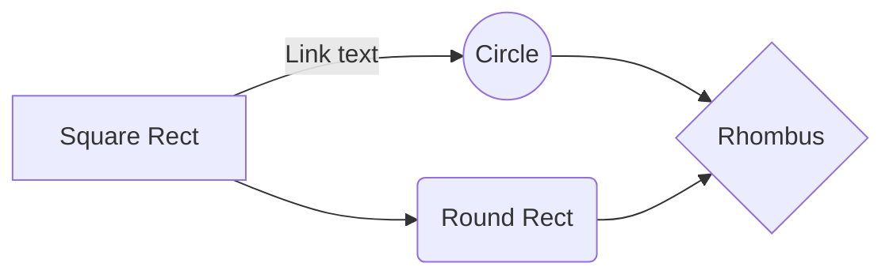
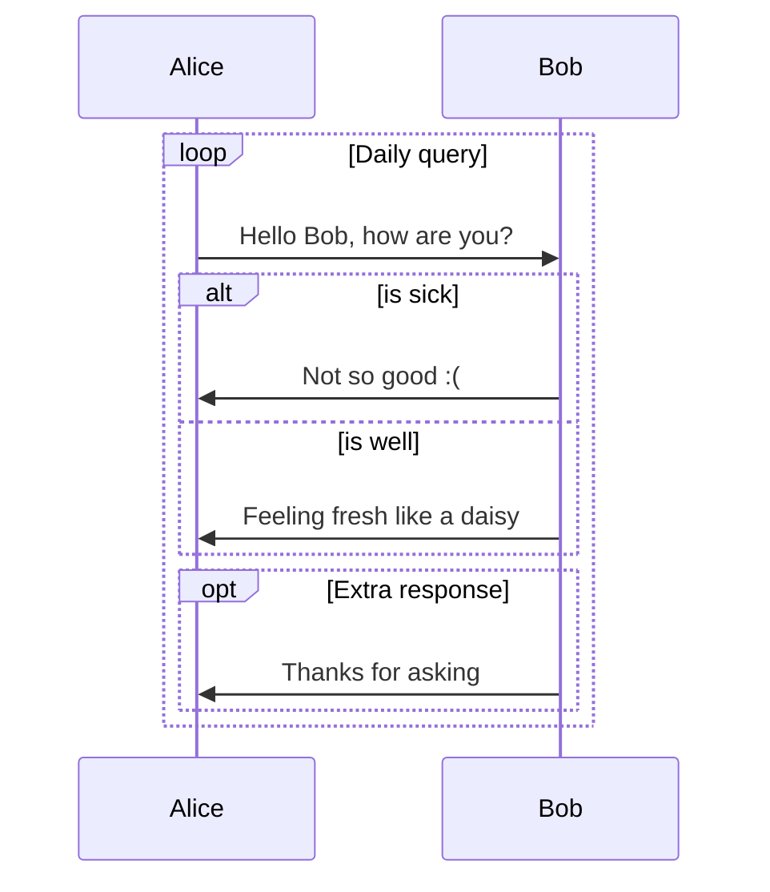

:::primary
[:rocket:快速开始](/computer-science/note/theme-shoka-doc/) - [:love_letter:依赖插件](/computer-science/note/theme-shoka-doc/dependents/) - [:pushpin:基本配置](/computer-science/note/theme-shoka-doc/config/) - [:rainbow:界面显示](/computer-science/note/theme-shoka-doc/display/) - [**:unicorn:特殊功能**](/computer-science/note/theme-shoka-doc/special/)
:::

:::info
以下介绍可以使用的markdown或者标签代码。
功能大部分基于`hexo-renderer-multi-markdown-it`渲染器，尤其是代码块的显示，与默认渲染器不兼容。
:::

# `links` 链接块
本功能参考NexT，基于Hexo Tag功能，用来建立友链或其他网址链接功能。

文章中的使用格式：

1. 使用`links`标签块，包围`yml`语法书写的内容，字段包括

--|--|--
`site`|站点名称|必填
`owner`|管理员名字|可选，默认为`site`的值
`url`|站点链接|必填
`desc`|站点描述|可选，默认为`url`的值
`image`|站点图片|可选，默认为`images/404.png`
`color`|方块颜色|可选，默认为`#666`

```raw 
&#123;% links %&#125;
- site: #站点名称
  owner: #管理员名字
  url: #站点网址
  desc: #简短描述
  image: #一张图片
  color: #颜色代码
&#123;% endlinks %&#125;
```

举个栗子：

```raw
&#123;% links %&#125;
- site: 優萌初華
  owner: 霜月琉璃
  url: https://shoka.lostyu.me
  desc: 琉璃的医学 & 编程笔记
  image: https://cdn.jsdelivr.net/gh/amehime/shoka@latest/images/avatar.jpg
  color: "#e9546b"

- site: 優萌初華
  owner: 霜月琉璃
  url: https://shoka.lostyu.me
  image: images/avatar.jpg

- site: 優萌初華
  url: https://shoka.lostyu.me
  desc: 琉璃的医学 & 编程笔记
  color: "#9d5b8b"
&#123;% endlinks %&#125;
```


- site: 優萌初華
  owner: 霜月琉璃
  url: https://shoka.lostyu.me
  desc: 琉璃的医学 & 编程笔记
  image: https://cdn.jsdelivr.net/gh/amehime/shoka@latest/images/avatar.jpg
  color: "#e9546b"

- site: 優萌初華
  owner: 霜月琉璃
  url: https://shoka.lostyu.me
  image: images/avatar.jpg

- site: 優萌初華
  url: https://shoka.lostyu.me
  desc: 琉璃的医学 & 编程笔记
  color: "#9d5b8b"



2. 以上标签块里的内容，还可以保存到一个`yml`文件中，然后使用`linksfile`标签。
其中，`path`位于`<root>/source`目录下。

```raw
&#123;% linksfile [path] %&#125;
```

举个栗子：

```raw
&#123;% linksfile friends/_data.yml %&#125;
```

# `code`代码块

使用`markdown-it-prism`进行代码高亮，支持显示行号、行高亮`mark`、命令行提示符`command`、代码块标题。

基本格式：`[language] [title] [url] [link text] [mark] [command]`

选项|描述|默认值
--|--|--
language| - 支持的语言[戳此](https://prismjs.com/#supported-languages)|null \
| | - 如果不需要代码高亮，但希望显示代码块样式，则设为`raw` | \
| | - 留空或设为`info`，将不显示代码高亮和代码块样式 | |
title|代码块的标题文字|null
url|代码块标题右侧显示的链接|null
link text|上述链接显示的标题|link
mark|行高亮显示，格式为`mark:行号,行号开始-行号结束,其他行号`。| null \
| |例如`mark:1,4-7,10`，将高亮显示第1、4、5、6、7、10行| |
command|命令行提示符，格式为`command:("提示内容":行号,行号||"提示内容":行号开始-行号结束)`| null \
| |例如`command:("[root@localhost] $":1,9-10||"[admin@remotehost] #":4-6)` | |

~~~raw
```java 行高亮 https://shoka.lostyu.me 参考链接 mark:1,6-7
import java.util.Scanner;
...
Scanner in = new Scanner(System.in);
// 输入Scan之后，按下键盘 Alt + “/” 键，Eclipse下自动补全。

System.out.println(in.nextLine());
System.out.println("Hello" + " world.");
```

```bash 命令行提示符 command:("[root@localhost] $":1,9-10||"[admin@remotehost] #":4-6)
pwd
/usr/home/chris/bin
ls -la
total 2
drwxr-xr-x   2 chris  chris     11 Jan 10 16:48 .
drwxr--r-x  45 chris  chris     92 Feb 14 11:10 ..
-rwxr-xr-x   1 chris  chris    444 Aug 25  2013 backup
-rwxr-xr-x   1 chris  chris    642 Jan 17 14:42 deploy
git add -A
git commit -m "update"
git push
```
~~~

```java 行高亮 https://shoka.lostyu.me 参考链接 mark:1,6-7
import java.util.Scanner;
...
Scanner in = new Scanner(System.in);
// 输入Scan之后，按下键盘 Alt + “/” 键，Eclipse下自动补全。

System.out.println(in.nextLine());
System.out.println("Hello" + " world.");
```

```bash 命令行提示符 command:("[root@localhost] $":1,9-10||"[admin@remotehost] #":4-6)
pwd
/usr/home/chris/bin
ls -la
total 2
drwxr-xr-x   2 chris  chris     11 Jan 10 16:48 .
drwxr--r-x  45 chris  chris     92 Feb 14 11:10 ..
-rwxr-xr-x   1 chris  chris    444 Aug 25  2013 backup
-rwxr-xr-x   1 chris  chris    642 Jan 17 14:42 deploy
git add -A
git commit -m "update"
git push
```

# `quiz` 练习题与答案
这个功能是用来显示练习题的。
需要在Front Matter中添加`quiz: true`，以正确显示题型标签。

~~~raw 几个例子
---
title: 练习题与答案
quiz: true
---

1. 编译时多态主要指运算符重载与函数重载，而运行时多态主要指虚函数。 {.quiz .true}

2. 有基类`SHAPE`，派生类`CIRCLE`，声明如下变量：  {.quiz .multi}
    ```cpp
    SHAPE shape1,*p1;
    CIRCLE circle1,*q1;
    ```
    下列哪些项是“派生类对象替换基类对象”。
    - `p1=&circle1;` {.correct}
    - `q1=&shape1;`
    - `shape1=circle1;` {.correct}
    - `circle1=shape1;`
{.options}
    > - :heavy_check_mark: 令基类对象的指针指向派生类对象
    > - :x: 派生类指针指向基类的引用
    > - :heavy_check_mark: 派生类对象给基类对象赋值
    > - :x: 基类对象给派生类对象赋值
    > {.options}

3. 下列叙述正确的是 []{.gap} 。 {.quiz}
    - 虚函数只能定义成无参函数
    - 虚函数不能有返回值
    - 能定义虚构造函数
    - A、B、C都不对 {.correct}
{.options}

10. 如果定义`int e=8; double f=6.4, g=8.9;`，则表达式 `f+int(e/3*int(f+g)/2)%4` 的值为 [9.4]{.gap}。 {.quiz .fill}
    > 注意运算顺序和数据类型
    > [8.4]{.mistake}
~~~

点击选项可以显示答案，以及答案解析。

1. 下列叙述正确的是 []{.gap} 。 {.quiz}
    - 虚函数只能定义成无参函数
    - 虚函数不能有返回值
    - 能定义虚构造函数
    - A、B、C都不对 {.correct}
{.options}

2. 有基类`SHAPE`，派生类`CIRCLE`，声明如下变量：  {.quiz .multi}
    ```cpp
    SHAPE shape1,*p1;
    CIRCLE circle1,*q1;
    ```
    下列哪些项是“派生类对象替换基类对象”。
    - `p1=&circle1;` {.correct}
    - `q1=&shape1;`
    - `shape1=circle1;` {.correct}
    - `circle1=shape1;`
{.options}
    > - :heavy_check_mark: 令基类对象的指针指向派生类对象
    > - :x: 派生类指针指向基类的引用
    > - :heavy_check_mark: 派生类对象给基类对象赋值
    > - :x: 基类对象给派生类对象赋值
    > {.options}

3. 编译时多态主要指运算符重载与函数重载，而运行时多态主要指虚函数。 {.quiz .true}

4. 如果定义`int e=8; double f=6.4, g=8.9;`，则表达式 `f+int(e/3*int(f+g)/2)%4` 的值为 [9.4]{.gap}。 {.quiz .fill}
    > 注意运算顺序和数据类型
    > [8.4]{.mistake}


## 使用说明
本功能基于`markdown-it-bracketed-spans`和`markdown-it-attrs`

标签|含义
--|--
`{.quiz}` | 选择题
`{.quiz .multi}` | 多选题
`{.quiz .true}` | 正确的判断题
`{.quiz .false}` | 错误的判断题
`{.quiz .fill}` | 填空题
`[]{.gap}` | 空白下划线
`[答案内容]{.gap}` | 答案内容带下划线
`{.options}` | ABCDE选项
`{.correct}` | 选择题的正确选项
`>` | 答案解析
`[8.4]{.mistake}` | 错题备注


# `emoji` 绘文字

本功能基于`markdown-it-emoji`，所有[标签参考戳此](https://github.com/markdown-it/markdown-it-emoji/blob/master/lib/data/full.json)

```raw
:kissing_heart:
:ring:
:notes:
```

:kissing_heart: :ring: :notes:

# `effects` 文字特效

本功能基于`markdown-it-ins`、 `markdown-it-bracketed-spans`和`markdown-it-attrs`

> 本主题风格颜色通用样式：default、primary、success、info、warning、danger

```raw
++下划线++
++波浪线++{.wavy}
++着重点++{.dot}
++紫色下划线++{.primary}
++绿色波浪线++{.wavy .success}
++黄色着重点++{.dot .warning}
~~删除线~~
~~红色删除线~~{.danger}
==荧光高亮==
[赤橙黄绿青蓝紫]{.rainbow}
[红色]{.red}
[粉色]{.pink}
[橙色]{.orange}
[黄色]{.yellow}
[绿色]{.green}
[靛青]{.aqua}
[蓝色]{.blue}
[紫色]{.purple}
[灰色]{.grey}
快捷键 [Ctrl]{.kbd} + [C]{.kbd .red}
H~2~0
29^th^
```

:::warning
这段代码因为自动被pangu.js处理了一下，加了几个空格，导致直接复制代码不能正常显示。
正确的代码是`++下划线++` `~~删除线~~` `==荧光高亮==`，不能有空格哦。
:::

++下划线++
++波浪线++{.wavy}
++着重点++{.dot}
++紫色下划线++{.primary}
++绿色波浪线++{.wavy .success}
++黄色着重点++{.dot .warning}
~~删除线~~
~~红色删除线~~{.danger}
==荧光高亮==
[赤橙黄绿青蓝紫]{.rainbow}
[红色]{.red}
[粉色]{.pink}
[橙色]{.orange}
[黄色]{.yellow}
[绿色]{.green}
[靛青]{.aqua}
[蓝色]{.blue}
[紫色]{.purple}
[灰色]{.grey}
快捷键 [Ctrl]{.kbd} + [C]{.kbd .red}
H~2~0
29^th^

# `spoiler`隐藏文字

本功能基于`markdown-it-spoiler`和`markdown-it-attrs`

```raw
!!黑幕黑幕黑幕黑幕黑幕黑幕!! ： 鼠标滑过显示内容
!!模糊模糊模糊模糊模糊模糊!!{.bulr} ： 选中文字显示内容
```

!!黑幕黑幕黑幕黑幕黑幕黑幕!! ： 鼠标滑过显示内容
!!模糊模糊模糊模糊模糊模糊!!{.bulr} ： 选中文字显示内容

# `label` 标签块

本功能基于`markdown-it-bracketed-spans`和`markdown-it-attrs`
有以下颜色可选

```raw
[default]{.label}
[primary]{.label .primary}
[info]{.label .info}
[:heavy_check_mark:success]{.label .success}
[warning]{.label .warning}
[:broken_heart:danger]{.label .danger}
```

[default]{.label}
[primary]{.label .primary}
[info]{.label .info}
[:heavy_check_mark:success]{.label .success}
[warning]{.label .warning}
[:broken_heart:danger]{.label .danger}

# `note` 提醒块

本功能基于`markdown-it-container`
标签为：

--|--
开始行|`:::[风格颜色]`
结束行|`:::`

```raw
:::default
默认默认
:::

:::primary
基本基本
:::

:::info
提示提示
:::

:::success
成功成功
:::

:::warning
警告警告
:::

:::danger
危险危险
:::

:::danger no-icon
危险危险
:::
```

:::default
默认默认
:::

:::primary
基本基本
:::

:::info
提示提示
:::

:::success
成功成功
:::

:::warning
警告警告
:::

:::danger
危险危险
:::

:::danger no-icon
没有图标
:::

# `tab`标签卡

本功能基于`markdown-it-container`
标签为：

--|--
开始行|`;;;[同一ID] [标签名称]`
结束行|`;;;`

```raw
;;;id1 卡片1
这里是卡片1的内容
**加粗**
[success]{.label .success}

&#123;% links %&#125;
- site: 優萌初華
  owner: 霜月琉璃
  url: https://shoka.lostyu.me
  desc: 琉璃的医学 & 编程笔记
  image: https://cdn.jsdelivr.net/gh/amehime/shoka@latest/images/avatar.jpg
  color: "#e9546b"
&#123;% endlinks %&#125;
;;;

;;;id1 卡片2
这里是卡片2的内容
:::danger
危险危险
:::
- 第一行
- 第二行
;;;

;;;id2 ②号标签卡片1
这里是卡片1的内容
;;;

;;;id2 ②号标签卡片2
这里是卡片2的内容
;;;
```
;;;id1 卡片1
这里是卡片1的内容
**加粗**
[success]{.label .success}


- site: 優萌初華
  owner: 霜月琉璃
  url: https://shoka.lostyu.me
  desc: 琉璃的医学 & 编程笔记
  image: https://cdn.jsdelivr.net/gh/amehime/shoka@latest/images/avatar.jpg
  color: "#e9546b"

;;;

;;;id1 卡片2
这里是卡片2的内容
:::danger
危险危险
:::
- 第一行
- 第二行
;;;

;;;id2 ②号标签卡片1
这里是卡片1的内容
;;;

;;;id2 ②号标签卡片2
这里是卡片2的内容
;;;

# `collapse` 折叠块

本功能基于`markdown-it-container`
标签为：

--|--
开始行|`+++[风格颜色] [标题文字]`
结束行|`+++`

```raw
+++ 默认默认 这里是一段文字
++下划线++
+++


+++primary 紫色
:::info
参考信息
:::

- 第一行
- 第二行
+++


+++info  蓝色
;;;id3 卡片1
这里是卡片1的内容
;;;

;;;id3 卡片2
这里是卡片2的内容
;;;
+++

+++success 绿色
&#123;% links %&#125;
- site: 優萌初華
  url: https://shoka.lostyu.me
  color: "#e9546b"
&#123;% endlinks %&#125;
+++

+++warning 黄色
!!警告警告警告警告警告!!{.bulr}
[label]{.label .success}
+++

+++danger 红色
[danger]{.label .danger}
+++
```

+++ 默认默认 这里是一段文字
++下划线++
+++


+++primary 紫色
:::info
参考信息
:::

- 第一行
- 第二行
+++


+++info  蓝色
;;;id3 卡片1
这里是卡片1的内容
++波浪线++{.wavy}
;;;

;;;id3 卡片2
这里是卡片2的内容
;;;
+++

+++success 绿色

- site: 優萌初華
  url: https://shoka.lostyu.me
  color: "#e9546b"

+++

+++warning 黄色
!!警告警告警告警告警告!!{.bulr}
[label]{.label .success}
+++

+++danger 红色
[danger]{.label .danger}
+++

# `taskList` 待办事项

本功能基于`markdown-it-task-checkbox`。
可以利用`markdown-it-attrs`添加风格颜色，只可以给`ul`标签添加，需要新建两行。

```raw
- [ ] 这是一个小叉叉
- [x] 这是一个红色勾勾

{.danger}

- [ ] 未完成
- [x] 完成

{.primary}

- [ ] 未完成
- [x] 默认颜色
```

- [ ] 这是一个小叉叉
- [x] 这是一个红色勾勾

{.danger}

- [ ] 未完成
- [x] 完成

{.primary}

- [ ] 未完成
- [x] 默认颜色

# `furigana`文字注音

原本用于日语汉字假名注音，但别的注音也可以。
为了兼容性，采用`markdown-it-ruby`的基本格式：`{文字^注音}`，并且为了兼容表格，将分隔符由`|`换成了`^`。
注音分隔基于`furigana-markdown-it`[显示说明看这里](https://www.npmjs.com/package/furigana-markdown-it#quick-usage)

--|--
`{取り返す^とりかえす}`|{取り返す^とりかえす}
`{可愛い犬^か+わい・い・いぬ}`|{可愛い犬^か+わい・い・いぬ}
`{可愛い犬^か・わい・いいぬ}`|{可愛い犬^か・わい・いいぬ}
`{アクセラレータ^accelerator}` | {アクセラレータ^accelerator}
`{accelerator^アクセラレータ}` | {accelerator^アクセラレータ}
`{食べる^たべる}` | {食べる^たべる}
`{食べる^=たべる}` | {食べる^=たべる}
`{あいうえお^*}` | {あいうえお^*}
`{あいうえお^*❤}` | {あいうえお^*❤}
`{常用账号^contact}`|{常用账号^contact}

# `media`多媒体
本功能基于Hexo Tag功能，使用`media`标签，目前可选择两种类型，即`audio`和`video`。

```raw
&#123;% media audio %&#125;
...音频列表
&#123;% endmedia %&#125;

&#123;% media video %&#125;
...视频列表
&#123;% endmedia %&#125;
```

标签包绕一段`yml`格式的内容，格式与[背景音乐](../config/#背景音乐)的配置类似。

亦可以直接使用网易云、虾米、QQ音乐的播放列表、单曲。


```raw 举个栗子
&#123;% media audio %&#125;
- title: 列表1
  list:
    - https://music.163.com/#/playlist?id=2943811283
    - https://music.163.com/#/playlist?id=2297706586
- title: 列表2
  list:
    - https://music.163.com/#/playlist?id=2031842656
&#123;% endmedia %&#125;


&#123;% media video %&#125;
- name: "测试1"
  url: https://cdn.kastatic.org/ka-youtube-converted/O_nY1TM2RZM.mp4/O_nY1TM2RZM.mp4#t=0
- name: "测试2"
  url: https://cdn.kastatic.org/ka-youtube-converted/O_nY1TM2RZM.mp4/O_nY1TM2RZM.mp4#t=0
&#123;% endmedia %&#125;
```


- title: 列表1
  list:
    - https://music.163.com/#/playlist?id=2943811283
    - https://music.163.com/#/playlist?id=2297706586
- title: 列表2
  list:
    - https://music.163.com/#/playlist?id=2031842656




- name: "测试1"
  url: https://cdn.kastatic.org/ka-youtube-converted/O_nY1TM2RZM.mp4/O_nY1TM2RZM.mp4#t=0
- name: "测试2"
  url: https://cdn.kastatic.org/ka-youtube-converted/O_nY1TM2RZM.mp4/O_nY1TM2RZM.mp4#t=0



# `math`数学公式

本功能基于`markdown-it-katex`
在Front Matter中添加`math: true`以支持[KaTex](https://katex.org/)

```raw
---
title: 数学公式显示
math: true
---

行内公式：$\sqrt{3x-1}+(1+x)^2$

独立块显示：
$$\begin{array}{c}

\nabla \times \vec{\mathbf{B}} -\, \frac1c\, \frac{\partial\vec{\mathbf{E}}}{\partial t} &
= \frac{4\pi}{c}\vec{\mathbf{j}}    \nabla \cdot \vec{\mathbf{E}} & = 4 \pi \rho \\

\nabla \times \vec{\mathbf{E}}\, +\, \frac1c\, \frac{\partial\vec{\mathbf{B}}}{\partial t} & = \vec{\mathbf{0}} \\

\nabla \cdot \vec{\mathbf{B}} & = 0

\end{array}$$
```

行内公式：$\sqrt{3x-1}+(1+x)^2$

独立块显示：
$$\begin{array}{c}

\nabla \times \vec{\mathbf{B}} -\, \frac1c\, \frac{\partial\vec{\mathbf{E}}}{\partial t} &
= \frac{4\pi}{c}\vec{\mathbf{j}}    \nabla \cdot \vec{\mathbf{E}} & = 4 \pi \rho \\

\nabla \times \vec{\mathbf{E}}\, +\, \frac1c\, \frac{\partial\vec{\mathbf{B}}}{\partial t} & = \vec{\mathbf{0}} \\

\nabla \cdot \vec{\mathbf{B}} & = 0

\end{array}$$


# `mermaid`流程图

本功能基于`markdown-it-mermaid`
在Front Matter中添加`mermaid: true`以支持[Mermaid](https://mermaid-js.github.io/mermaid/#/)

~~~raw
---
title: 流程图显示
mermaid: true
---




~~~


